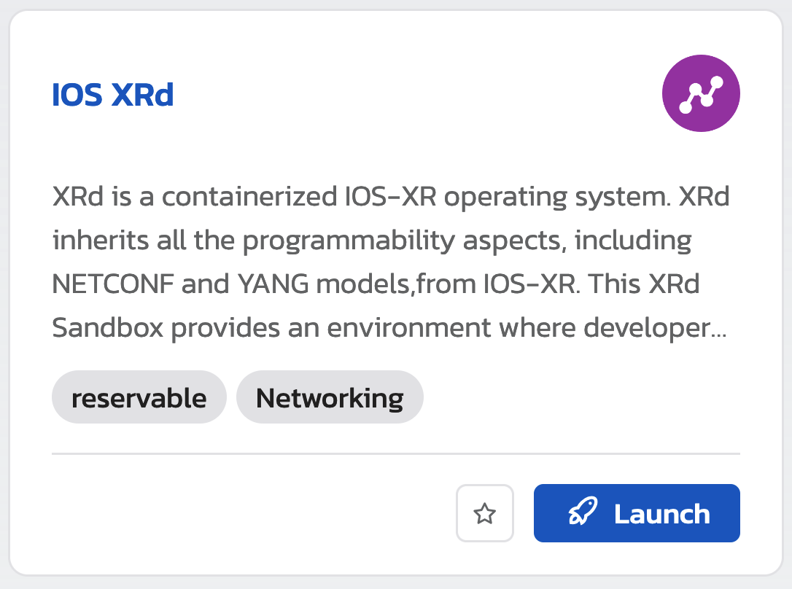

# XRd-Sandbox

XRd is a containerized IOS-XR operating system that you can deploy on any kind of on-premises or public cloud infrastructure.

XRd inherits all the programmability aspects, including NETCONF and YANG models, from IOS-XR.

The XRd Sandbox provides an environment where developers and network engineers can explore the programmability options available.

> [!IMPORTANT]
> On this repository you can find the files used to create the XRd sandbox.

Find the XRd sandbox at [developer.cisco.com/sandbox](https://developer.cisco.com/site/sandbox/) click on _"Launch Sandbox"_ look for the XRd Sandbox and create a reservation.



On the XRd Sandbox, you find:

- Ubuntu VM with a Docker image of XRd control plane.
- Sample Sandbox XRd Topology.
- Copy of [xrd-tools GitHub repository.](https://github.com/ios-xr/xrd-tools/tree/main)

At the end of the Sandbox, you learn how to work with XRd in a containerized environment with a working segment routing topology.

## Lab

We have prepared one Lab to run a segment routing topology that consists of seven (7) XRd routers. One of the XRd routers functions as a PCE, and another XRd router serves as a vRR. Also, we use two alpine containers as the source and destination hosts.

```bash

               xrd-7(PCE)
               /        \
            xrd-3 --- xrd-4
             / |        | \
src --- xrd-1  |        |  xrd-2 --- dst
             \ |        | /
            xrd-5 --- xrd-6
               \        /
               xrd-8(vRR)
```

The Lab is a copy of the [segment-routing sample topology](https://github.com/ios-xr/xrd-tools/tree/main/samples/xr_compose_topos/segment-routing) from [xrd-tools](https://github.com/ios-xr/xrd-tools) with additional _modifications_ to work on the Sandbox management network.

### Docker Driver

[Docker macvlan](https://docs.docker.com/engine/network/drivers/macvlan/) represents one modification that allows the `XRd` containers to be on the same management network as the host.

```yml
networks:
  mgmt:
    ipam:
      config:
        - subnet: 10.10.20.0/24
          gateway: 10.10.20.254
    driver: macvlan
    driver_opts:
      parent: ens160
```

See the [docker-compose.xr.yml file](docker-compose.xr.yml#L186) to see the full configuration.

### Host-check

When working on your own environment, ensure you run [host-check](https://github.com/ios-xr/xrd-tools/blob/main/scripts/host-check) to verify your host is ready for `XRd`. Make sure you pick the right choices for your image (control plave or vrouter). The host in the Sandbox is already prepared.

> [!NOTE]
> You won't be able to run the command since it requires `sudo` privileges. Look at the output to become familiar with it.

```bash
sudo ~/xrd-tools/scripts/host-check --platform xrd-control-plane --extra-checks docker --extra-checks xr-compose
```

<details>
<summary>OUTPUT</summary>

```bash
developer@ubuntu:~$ sudo ~/xrd-tools/scripts/host-check --platform xrd-control-plane --extra-checks docker --extra-checks xr-compose
==============================
Platform checks - xrd-control-plane
==============================
 PASS -- CPU architecture (x86_64)
 PASS -- CPU cores (10)
 PASS -- Kernel version (5.15)
 PASS -- Base kernel modules
         Installed module(s): dummy, nf_tables
 INFO -- Cgroups
         Cgroups v2 is in use - this is not supported for production environments.
 PASS -- Inotify max user instances
         64000 - this is expected to be sufficient for 16 XRd instance(s).
 PASS -- Inotify max user watches
         249493 - this is expected to be sufficient for 62 XRd instance(s).
 PASS -- Socket kernel parameters (valid settings)
 PASS -- UDP kernel parameters (valid settings)
 INFO -- Core pattern (core files managed by the host)
 PASS -- ASLR (full randomization)
 WARN -- Linux Security Modules
         AppArmor is enabled. XRd is currently unable to run with the
         default docker profile, but can be run with
         '--security-opt apparmor=unconfined' or equivalent.
         However, some features might not work, such as ZTP.
 PASS -- Kernel module parameters
         Kernel modules loaded with expected parameters.
 PASS -- RAM
         Available RAM is 30.6 GiB.
         This is estimated to be sufficient for 15 XRd instance(s), although memory
         usage depends on the running configuration.
         Note that any swap that may be available is not included.

==============================
Extra checks
==============================

xr-compose checks
-----------------------
 PASS -- docker-compose (version 2.24.0)
 PASS -- PyYAML (installed)
 FAIL -- Bridge iptables
         For xr-compose to be able to use Docker bridges, bridge IP tables must
         be disabled. Note that there may be security considerations associated
         with doing so.
         Bridge IP tables can be disabled by setting the kernel parameters
         net.bridge.bridge-nf-call-iptables and net.bridge.bridge-nf-call-ip6tables
         to 0. These can be modified by adding 'net.bridge.bridge-nf-call-iptables=0'
         and 'net.bridge.bridge-nf-call-ip6tables=0' to /etc/sysctl.conf or in a
         dedicated conf file under /etc/sysctl.d/.
         For a temporary fix, run:
           sysctl -w net.bridge.bridge-nf-call-iptables=0
           sysctl -w net.bridge.bridge-nf-call-ip6tables=0

============================================================================
!! One or more platform checks resulted in a warning, see warnings above !!
----------------------------------------------------------------------------
Extra checks failed: xr-compose
============================================================================
developer@ubuntu:~$
```

</details>

### Start the Lab

To practice, go to [developer.cisco.com/sandbox](https://developer.cisco.com/site/sandbox/) click on _"Launch Sandbox"_ look for the XRd Sandbox and create a reservation.

## Learn more

Look at the [xrdocs tutorials](https://xrdocs.io/virtual-routing/tutorials/) which explain in detail all the _in-and-outs_ of XRd.

You can find additional Labs on the [xrd-tools samples GitHub repository.](https://github.com/ios-xr/xrd-tools/tree/main/samples/xr_compose_topos)

Checkout our [IOS-XR Dev Center](https://developer.cisco.com/site/ios-xr/) on DevNet to find more material around `IOS-XR` programmability.

## Help

For _questions_ about `XRd` itself go to the [Network Devices community.](https://community.cisco.com/t5/network-devices/bd-p/disc-dev-network-devices)

For _issues_ with the Sandbox, first, release your current reservation and initiate a new one. If the issues persist, contact the Sandbox team [on the Sandbox community space.](https://communities.cisco.com/community/developer/sandbox)

## Appendix - Changes done on the VM

### Docker Pools

We set up default address pools to avoid overlapping with networks used by the Sandbox, which caused traffic blackholes.

```bash
developer@ubuntu:~$ cat /etc/docker/daemon.json
{
  "default-address-pools": [
    {
      "base": "172.80.0.0/16",
      "size": 24
    }
  ]
}
developer@ubuntu:~$
```
