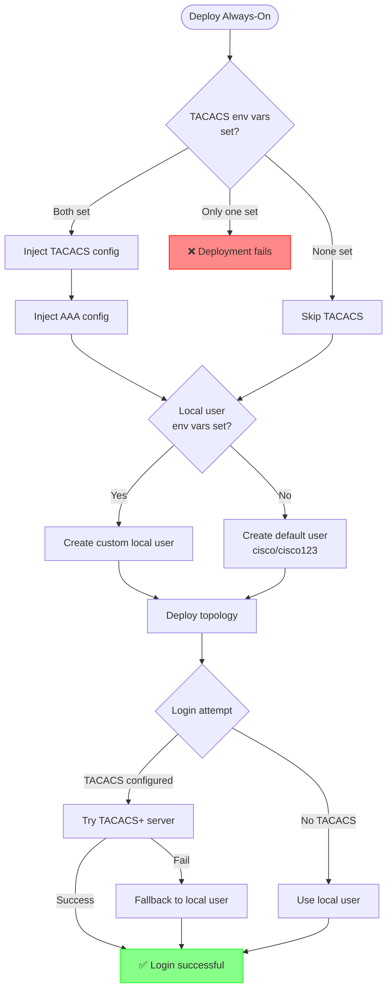

# Sandbox Always-On Topology Deployment Guide

## 📋 Environment Variables

| Variable                  | Required | Default    | Description               |
| ------------------------- | -------- | ---------- | ------------------------- |
| `TACACS_SERVER_IP`        | No       | -          | TACACS+ server IP address |
| `TACACS_SECRET_KEY`       | No       | -          | TACACS+ shared secret key |
| `FALLBACK_LOCAL_USERNAME` | No       | `cisco`    | Local fallback username   |
| `FALLBACK_LOCAL_PASSWORD` | No       | `cisco123` | Local fallback password   |

> [!NOTE]
> Both `TACACS_SERVER_IP` and `TACACS_SECRET_KEY` must be set together. If only one is provided, deployment will fail.

## 🔐 Authentication Configuration Flow



## 🚀 Quick Start

### Automated Deployment (Recommended)

**With TACACS+ authentication:**

```bash
export TACACS_SERVER_IP="192.168.1.100"
export TACACS_SECRET_KEY="your-secret"
export FALLBACK_LOCAL_USERNAME="admin"
export FALLBACK_LOCAL_PASSWORD="secure-password"
make deploy-always-on
```

**Without TACACS+ (local user only):**

```bash
export FALLBACK_LOCAL_USERNAME="admin"
export FALLBACK_LOCAL_PASSWORD="secure-password"
make deploy-always-on
```

**Monitor logs:**

```bash
make follow-always-on-logs
```

**Undeploy:**

```bash
make undeploy-always-on
```

## 🔧 Manual Deployment

> [!IMPORTANT]
> Manual deployment requires you to configure authentication. Without it, XRd will prompt for user creation on first boot.

### With TACACS+ Authentication

```bash
# Set environment variables
export TACACS_SERVER_IP="192.168.1.100"
export TACACS_SECRET_KEY="your-secret"
export FALLBACK_LOCAL_USERNAME="admin"
export FALLBACK_LOCAL_PASSWORD="secure-password"

# Inject authentication configs
./scripts/deployment/always-on/inject-local-user.sh
./scripts/deployment/always-on/inject-tacacs-aaa.sh
./scripts/deployment/always-on/inject-tacacs-config.sh

# Generate and deploy
xr-compose \
  --input-file /home/developer/XRd-Sandbox/topologies/always-on/docker-compose.xr.yml \
  --output-file /home/developer/XRd-Sandbox/topologies/always-on/docker-compose.yml \
  --image ios-xr/xrd-control-plane:25.3.1

sed -i.bak 's/linux:xr-30/linux:eth0/g' \
  /home/developer/XRd-Sandbox/topologies/always-on/docker-compose.yml

docker compose --file \
  /home/developer/XRd-Sandbox/topologies/always-on/docker-compose.yml \
  up --detach
```

### Without TACACS+ (Local User Only)

```bash
# Set environment variables (optional)
export FALLBACK_LOCAL_USERNAME="admin"
export FALLBACK_LOCAL_PASSWORD="secure-password"

# Inject local user
./scripts/deployment/always-on/inject-local-user.sh

# Generate and deploy
xr-compose \
  --input-file /home/developer/XRd-Sandbox/topologies/always-on/docker-compose.xr.yml \
  --output-file /home/developer/XRd-Sandbox/topologies/always-on/docker-compose.yml \
  --image ios-xr/xrd-control-plane:25.3.1

sed -i.bak 's/linux:xr-30/linux:eth0/g' \
  /home/developer/XRd-Sandbox/topologies/always-on/docker-compose.yml

docker compose --file \
  /home/developer/XRd-Sandbox/topologies/always-on/docker-compose.yml \
  up --detach
```

### Monitor/Stop

```bash
# Monitor logs
docker compose --file \
  /home/developer/XRd-Sandbox/topologies/always-on/docker-compose.yml \
  logs --follow

# Stop topology
docker compose --file \
  /home/developer/XRd-Sandbox/topologies/always-on/docker-compose.yml \
  down --volumes --remove-orphans
```

## 📝 Injected Configuration Examples

### TACACS+ Server Config

```text
tacacs source-interface MgmtEth0/RP0/CPU0/0 vrf default
tacacs-server host <TACACS_SERVER_IP> port 49
 key 0 <TACACS_SECRET_KEY>
```

### AAA Config (with TACACS+)

```text
aaa authentication login default group tacacs+ local
aaa authorization exec default group tacacs+ local
aaa authorization commands default group tacacs+ local
```

### Local User Config

```text
username <USERNAME>
 group root-lr
 group cisco-support
 secret 10 <SHA512_HASH>
```

## 🔍 Troubleshooting

| Issue               | Solution                                                                      |
| ------------------- | ----------------------------------------------------------------------------- |
| Cannot login        | Check TACACS+ server connectivity, or try fallback local user                 |
| TACACS+ not applied | Verify both `TACACS_SERVER_IP` and `TACACS_SECRET_KEY` are set                |
| Password hash fails | Ensure Python 3 is installed: `python3 --version`                             |
| No user configured  | Check startup files: `grep "username" topologies/always-on/xrd-1-startup.cfg` |

## 📚 Additional Resources

- [Local User Configuration Details](../../scripts/deployment/always-on/LOCAL_USER_README.md)
- [XRd Documentation](https://www.cisco.com/c/en/us/td/docs/routers/virtual-routers/xrd.html)
