# Sandbox Always-On Topology Deployment Guide

## 🚀 Quick Start - Automated Deployment (Recommended)

**With TACACS+ authentication:**

```bash
export TACACS_SERVER_IP="192.168.1.100"
export TACACS_SECRET_KEY="your-secret"
export FALLBACK_LOCAL_USERNAME="admin"
export FALLBACK_LOCAL_PASSWORD="secure-password"
make deploy-always-on
```

**Monitor logs:**

```bash
make follow-always-on-logs
```

**Undeploy:**

```bash
make undeploy-always-on
```

## 📋 Environment Variables

| Variable                  | Required | Default    | Description               |
| ------------------------- | -------- | ---------- | ------------------------- |
| `TACACS_SERVER_IP`        | No       | -          | TACACS+ server IP address |
| `TACACS_SECRET_KEY`       | No       | -          | TACACS+ shared secret key |
| `FALLBACK_LOCAL_USERNAME` | No       | `cisco`    | Local fallback username   |
| `FALLBACK_LOCAL_PASSWORD` | No       | `cisco123` | Local fallback password   |

> [!NOTE]
> Both `TACACS_SERVER_IP` and `TACACS_SECRET_KEY` must be set together. If only one is provided, deployment will fail.

## 🔐 Authentication Configuration Flow

```mermaid
flowchart TD
    Start([Make deploy-always-on]) --> CheckTACACS{TACACS env vars<br/>set?}

    CheckTACACS -->|Both set| InjectTACACS[Inject TACACS config]
    CheckTACACS -->|None set| SkipTACACS[Skip TACACS]
    CheckTACACS -->|Only one set| Error[❌ Deployment fails]

    InjectTACACS --> InjectAAA[Inject AAA config]
    InjectAAA --> CheckLocalUser{Local user<br/>env vars set?}

    SkipTACACS --> CheckLocalUser

    CheckLocalUser -->|Yes| CustomUser[Create custom local user]
    CheckLocalUser -->|No| DefaultUser[Create default user<br/>cisco/cisco123]

    CustomUser --> Deploy[Build and deploy XRd containers]
    DefaultUser --> Deploy

    Deploy --> AuthFlow{Login attempt}

    AuthFlow -->|TACACS configured| TryTACACS[Try TACACS+ server]
    AuthFlow -->|No TACACS| UseLocal[Use local user]

    TryTACACS -->|Success| LoginOK[✅ Login successful]
    TryTACACS -->|Fail| Fallback[Fallback to local user]

    Fallback --> LoginOK
    UseLocal --> LoginOK

    style Error fill:#f88,stroke:#f00
    style LoginOK fill:#8f8,stroke:#0f0
```



## 🔧 Manual Deployment

### Local User Only, No TACACS+

```bash
# Set environment variables (optional)
export FALLBACK_LOCAL_USERNAME="cisco"
export FALLBACK_LOCAL_PASSWORD="cisco123"

# Inject local user
# If you do not set the above variables, defaults (cisco/cisco123) will be used.
# if you don't run this script, no local user will be created and XRd will prompt for user creation on first boot.
./scripts/deployment/always-on/inject-local-user.sh

# Generate and deploy
xr-compose \
  --input-file /home/developer/XRd-Sandbox/topologies/always-on/docker-compose.xr.yml \
  --output-file /home/developer/XRd-Sandbox/topologies/always-on/docker-compose.yml \
  --image ios-xr/xrd-control-plane:25.3.1

sed -i.bak 's/linux:xr-30/linux:eth0/g' \
  /home/developer/XRd-Sandbox/topologies/always-on/docker-compose.yml

docker compose --file \
  /home/developer/XRd-Sandbox/topologies/always-on/docker-compose.yml \
  up --detach
```

## 📝 Injected Configuration Examples

TACACS+ Server Config

```text
tacacs source-interface MgmtEth0/RP0/CPU0/0 vrf default
tacacs-server host <TACACS_SERVER_IP> port 49
 key 0 <TACACS_SECRET_KEY>
```

For aaa config, see [aaa-config.cfg file.](../../scripts/deployment/always-on/aaa-config.cfg)

For the local user config, [see the fallback_local_user.cfg file.](../../scripts/deployment/always-on/fallback_local_user.cfg)

## 🔍 Troubleshooting

| Issue               | Solution                                                                      |
| ------------------- | ----------------------------------------------------------------------------- |
| TACACS+ not applied | Verify both `TACACS_SERVER_IP` and `TACACS_SECRET_KEY` are set                |
| Password hash fails | Ensure Python 3 is installed: `python3 --version`                             |
| No user configured  | Check startup files: `grep "username" topologies/always-on/xrd-1-startup.cfg` |

## 📚 Additional Resources

- You can find the script to deploy this sandbox on the [deployment/always-on directoyr](../../scripts/deployment/always-on/)
